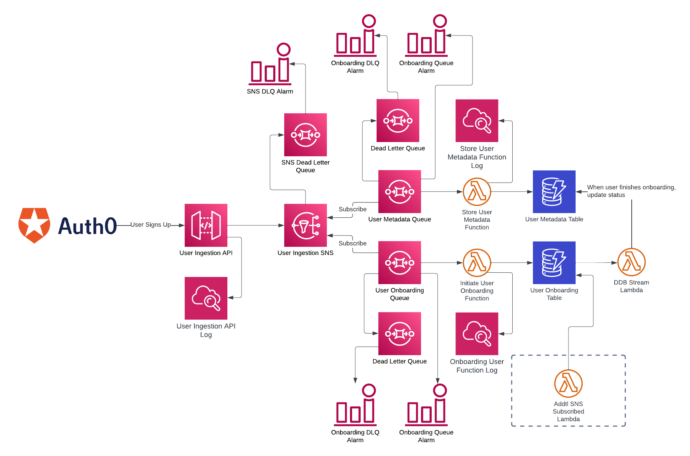

# Designing a Highly Scalable User Ingestion System

#### Using Auth0 as an Identity Provider

## Intro

[Auth0](https://auth0.com/) is a great identity service provider for quickly bootstrapping an enterprise application with user management. Unless you're a big company with capable resources, you don't really want to reinvent a new identify platform.

In this article, I will show you on a high-level how I handle user ingestions from Auth0 to AWS infrastructure that I can integrate user identity into the backend user workflows.

## Diagram



## Breakdowns

### Auth0 Action
[Auth0 Action](https://auth0.com/docs/customize/actions) allows you to write a small code snippet to be executed upon user login or registration. It also exposes [some user metadata](https://auth0.com/docs/customize/actions/flows-and-triggers/post-user-registration-flow/event-object) that can be passed to the script and then send externally.

Below is the sample code I used for the custom action of [**Post User Registration**](https://auth0.com/docs/customize/actions/flows-and-triggers/post-user-registration-flow).

**Auth0 specifics**: You should only send unique user identifiers that are immutable. Fields like IP, latitude, longitude can be obtained from Auth0 API. They also tend to change over time, you don't want to keep the potentially out-of-sync copy. In this case, I choose to send `username`, `email` and `user_id` to AWS.
```
const axios = require("axios");

exports.onExecutePostUserRegistration = async (event, api) => {
  const message = {
    username: event.user.username,
    email: event.user.email,
    user_id: event.user.user_id,
  };
  const params = {
    topic: event.secrets.TOPIC_URL,
    subject: "New user signup",
    message: JSON.stringify(message),
  };
  await axios.get(event.secrets.API_URL,
    {
      params,
      headers: {
        "x-api-key": event.secrets.API_KEY,
      },
    }
  );
};
```

__If you use an identify provider other than Auth0, you can send the metadata with a simple API call as described below.__

### API Gateway
We have an [**edge-optimized**](https://docs.aws.amazon.com/apigateway/latest/developerguide/api-gateway-api-endpoint-types.html) API Gateway endpoint backed by REST API. It's protected by API key, throttled, and access logged.

The payload is sent to API Gateway as GET query string parameters in following format:
```
https://API-DOMAIN.com/ENDPOINT?topic=[TOPIC-ARN]&message=[URL-ENCODED-TOPIC]&subject=[URL-ENCODED-SUBJECT]
```
`message` needs to be a JSON string containing the user metadata fields and **URL encoded**. Subject also needs to be **URL encoded** if containing spaces, but it's not being used in my case.

To secure the API call, `x-api-key` needs to be passed in the header.

### SNS Topic
API Gateway forwards the payload to SNS topic. The SNS Topic makes infrastructure scaling possible. You can have many services subscribed to the topic creating publish/subscribe or fan-out pattern.

Attached to the SNS topic is a dead letter queue to catch any undeliverable message.

### Worker Queues
You can have many worker queues as you like. They are subscribed to the SNS topic and configured as event source for the Lambda function to process the messages it receives from SNS.

*You could also directly invoke the Lambda function from SNS topic, however by using the SQS in between, it decouples the producer and consumer hence makes the system fault tolerant. Not only it can catch the invalid messages that Lambda can't process, it can also handle the throttling issue if Lambda ever hits concurrency limit by utilizing the dead letter queue. With redrive policy, failed messages can be looked at and reprocessed.*

### Worker Lambda
Lambda function receives and processes the message. Simple. All logs are saved to CloudWatch.

### DynamoDB Stream
DynamoDB table is configured to invoke a Lambda function whenever a row is created, updated and deleted.

### CloudWatch Alarm
Alarms are setup to notify:
* If messages took too long to process
* If dead letter queue has too many messages

### Security
* Auth0 Action allows to save secrets as environment variables, plus we use API key for the API Gateway
* SNS and SQS are encrypted at rest using a customer managed KMS key (AWS managed `alias/aws/sqs` or `alias/aws/sns` keys can't be used with this setup. [See limitations here](https://repost.aws/knowledge-center/sns-topic-sqs-queue-sse-cmk-policy).)

### What's Next
In my backend API, I can get the `user_id` from [the decoded JWT payload](https://www.npmjs.com/package/express-oauth2-jwt-bearer) as `req.auth.payload.sub`. I know the user is legitimate and I can go ahead to look up user data belongs to that `user_id`. 

### Demo
I have a bare minimum demo that can be spun up using CloudFormation. Check out the source code at: [https://github.com/alanzhaonys/user-ingestion](https://github.com/alanzhaonys/user-ingestion)
* `cd` into `cfn/user-metadata` and update the `deploy.sh`. Run it to deploy the infrastructure
* Once CloudFormation is complete, grab the **API Gateway URL**, **API Key** and **TOPIC Arn**, update the `test.sh` at the project root, run it to ingest a test user record
* Check out the CloudWatch logs
* Modify Lambda functions to fit your need

The AWS resources in the provided CloudFormation are provisioned at the lowest possible settings to avoid costs. It's not meant for production.
